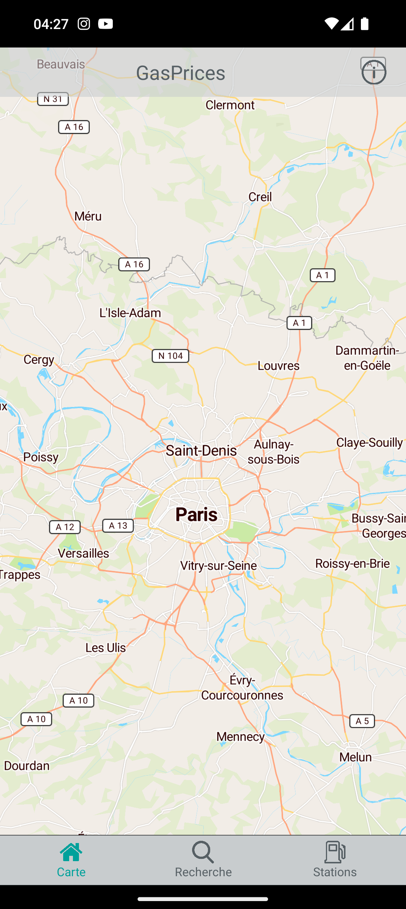
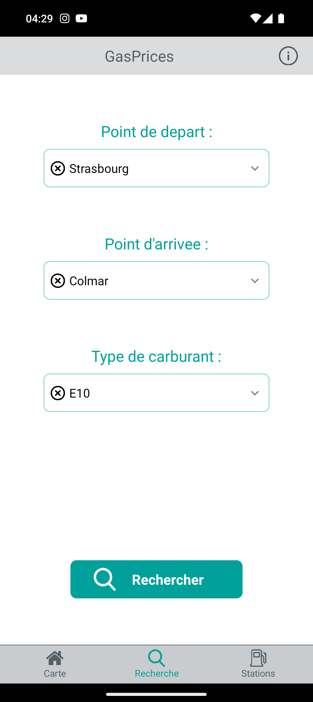
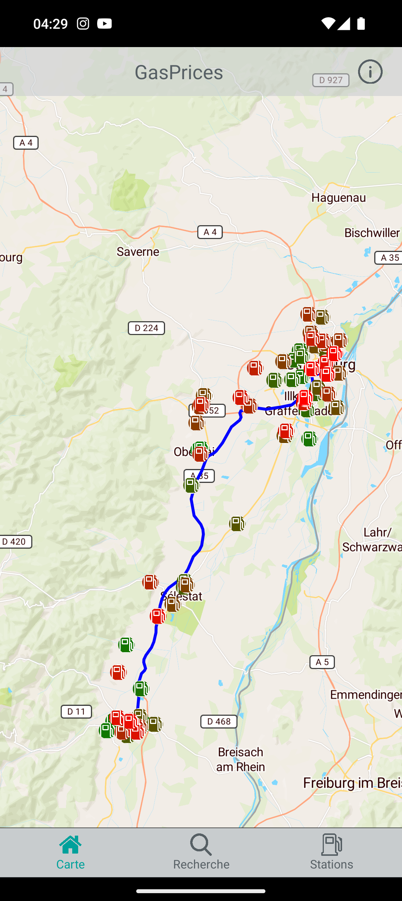
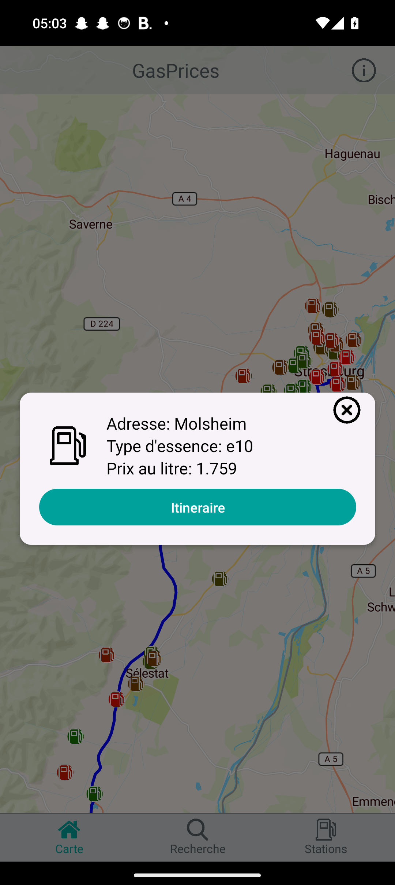
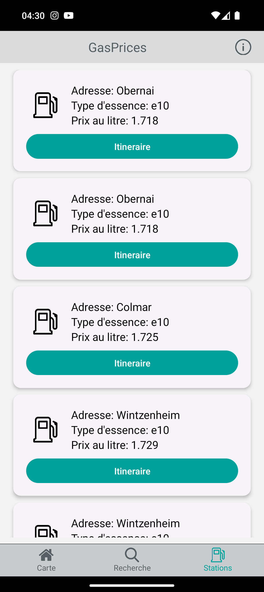
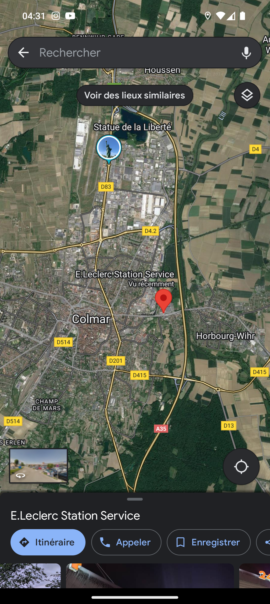

# Gas prices

Check the lowest gas prices on your itinerary in France.

## Description

The goal of this app is to select the fuel that you need and the itinerary that you are planning to follow.

You will then be able to see all of the gas stations in a range of 10km around your itinerary.

Look for the green gas stations, they are the cheapest.

Click on them to display informations about the adress and the price or go to the 'Stations' page', the first one will be the cheapest !

Currently working for Android devices only.

## Contribute to Gas Prices

### Prerequisites

In order to use Gas Prices, you must have Android studio on your computer ([Installation tutorial](https://developer.android.com/studio?gclid=CjwKCAiAk9itBhASEiwA1my_6-dk0m3UvyOMjxqDJeNsd9j0jMEXx3uFZYSBSyfwXPqqH3YuMeWnxxoCY3oQAvD_BwE&gclsrc=aw.ds))

### Installation

1. Clone the repository.

   Run the following command:

   ```bash
   git clone https://github.com/titi0267/GasPrices.git
   ```

2. Add a .env file with the following fields to the project.

   - You can use my hosted Api

   ```.env
    HOST=https://gas-price-france-yaws.vercel.app/
   ```
   OR

   - You can use it on local, follow [GasPrices-Api](https://github.com/titi0267/GasPrices-Api) guidelines
     
   ```.env
    HOST=http://localhost:8080
   ```

   - Generate a [Jawg api key](https://www.jawg.io/en/)

   ```.env
    JAWG_API_KEY=
   ```

   - Generate a [Mapbox api key](https://www.mapbox.com/)

   ```.env
   MAPBOX_API_KEY=
   ```

4. Install the dependencies with npm

   ```bash
   npm i
   ```

5. Extra steps for a physical device:
   - Connect your device to your computer
   - Make sure to enable developer mode
   - Make sure to enable file transfert

### Launch

Launch the project with
`npm run android`.

## Overview

<p align="left">
     &nbsp;&nbsp;&nbsp;&nbsp;&nbsp;&nbsp;&nbsp;  &nbsp;&nbsp;&nbsp;&nbsp;&nbsp;&nbsp;&nbsp;&nbsp;&nbsp;&nbsp;&nbsp;&nbsp;&nbsp;&nbsp;&nbsp;  &nbsp;&nbsp;&nbsp;&nbsp;&nbsp;&nbsp;
  <span>Navigate on the map</span>
    &nbsp;&nbsp;&nbsp;&nbsp;&nbsp;&nbsp;&nbsp;&nbsp;&nbsp;&nbsp;&nbsp;&nbsp;&nbsp;&nbsp;  &nbsp;&nbsp;&nbsp;&nbsp;&nbsp;&nbsp;&nbsp;&nbsp;&nbsp;&nbsp;&nbsp;&nbsp;&nbsp;&nbsp;&nbsp;&nbsp;&nbsp;&nbsp;&nbsp;&nbsp;&nbsp;
  <span>Search for your itinerary & your fuel</span>
</p>

<p align="center">
  
  &nbsp;&nbsp;&nbsp;&nbsp;&nbsp;&nbsp;&nbsp;&nbsp;&nbsp;&nbsp;&nbsp;&nbsp;&nbsp;&nbsp;&nbsp;&nbsp;
  
</p>

<p align="left">
    &nbsp;&nbsp;&nbsp;&nbsp;&nbsp;&nbsp;&nbsp;&nbsp; &nbsp;&nbsp;&nbsp;&nbsp;&nbsp;&nbsp;&nbsp;
  <span>Display the gas stations along your itinerary</span>
      &nbsp;&nbsp;&nbsp;&nbsp;&nbsp;&nbsp;&nbsp;&nbsp;&nbsp;&nbsp;&nbsp;&nbsp;&nbsp;&nbsp;&nbsp;&nbsp;&nbsp;&nbsp;&nbsp;&nbsp;&nbsp;
  <span>Click on one of the gas station</span>
</p>

<p align="center">
  
  &nbsp;&nbsp;&nbsp;&nbsp;&nbsp;&nbsp;&nbsp;&nbsp;&nbsp;&nbsp;&nbsp;&nbsp;&nbsp;&nbsp;&nbsp;&nbsp;
  
</p>

<p align="left">
    &nbsp;&nbsp;&nbsp;&nbsp;&nbsp;&nbsp;&nbsp;  &nbsp;&nbsp;&nbsp;&nbsp;&nbsp;&nbsp;&nbsp;&nbsp;&nbsp;&nbsp;&nbsp;&nbsp;&nbsp;&nbsp;&nbsp;  &nbsp;&nbsp;&nbsp;&nbsp;&nbsp;&nbsp;
  <span>Check the lowest price</span>
    &nbsp;&nbsp;&nbsp;&nbsp;&nbsp;&nbsp;&nbsp;&nbsp;&nbsp;&nbsp;&nbsp;&nbsp;&nbsp;&nbsp;  &nbsp;&nbsp;&nbsp;&nbsp;&nbsp;&nbsp;&nbsp;&nbsp;&nbsp;&nbsp;&nbsp;&nbsp;&nbsp;&nbsp;&nbsp;&nbsp;&nbsp;&nbsp;&nbsp;&nbsp;&nbsp;
  <span>Redirect to maps and start driving</span>
</p>

<p align="center">
  
  &nbsp;&nbsp;&nbsp;&nbsp;&nbsp;&nbsp;&nbsp;&nbsp;&nbsp;&nbsp;&nbsp;&nbsp;&nbsp;&nbsp;&nbsp;&nbsp;
  
</p>

## About

Feel free to open issues for suggestions, bugs or new features that you would like to see in this app !
